# TUTORIAL - CREATION APPLICATION UI5

## BACKEND

    
CREATION - SPECIFIC UI5 PACKAGE

- ``SE80`` - Création du package UI5 ``ZLOG_PALETTE_PAN``

    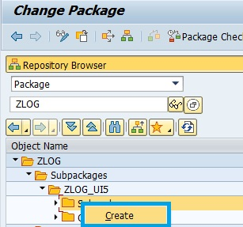

    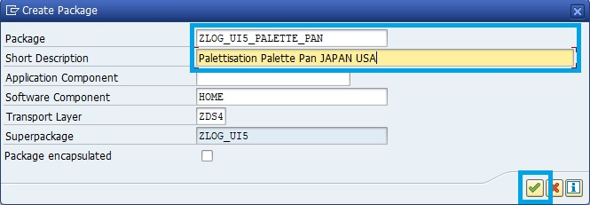

    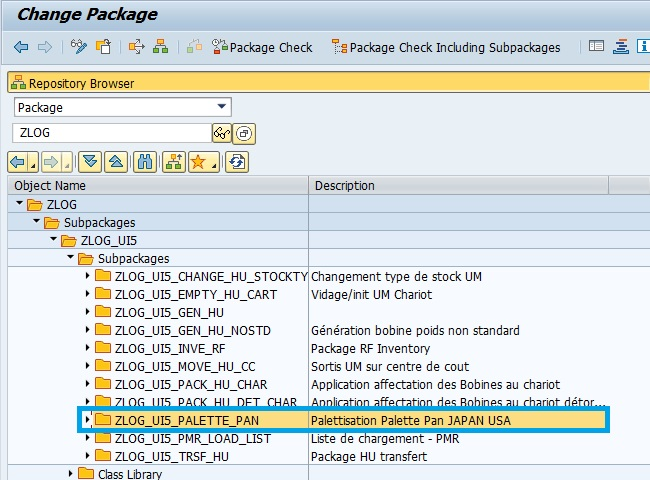
  

    
CREATION - OT

- ``SE10`` - Création de l'OT ``LOG - 11384 - Palettisation Palette Pan JAPAN USA``

    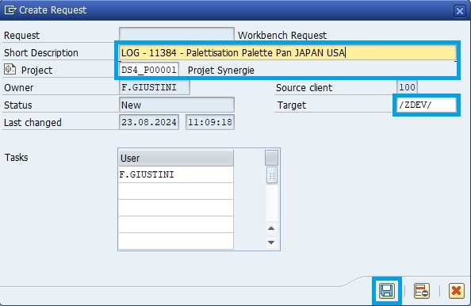

    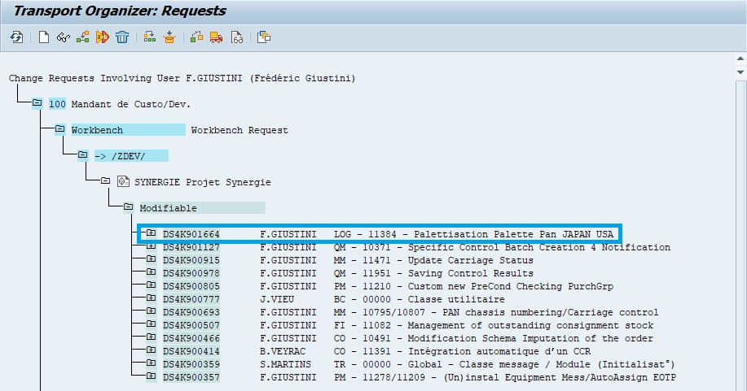
  

    
CREATION - GATEWAY

- ``SEGW`` - Création de la Gateway ``ZLOG_PALETTE_PAN``

    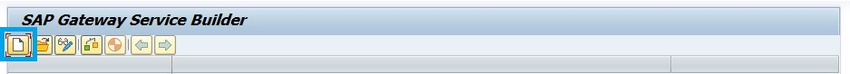

    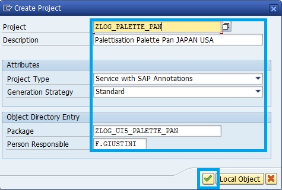

    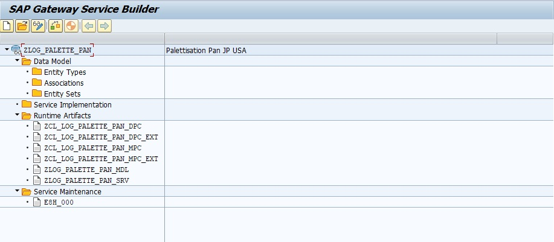
  

    
ACTIVATION - SERVICE

- ``/IWFND/MAINT_SERVICE`` - Activation du Service ``ZLOG_PALETTE_PAN``

    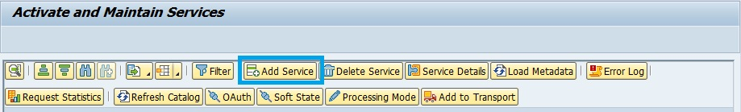

    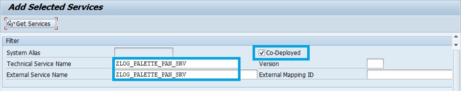

    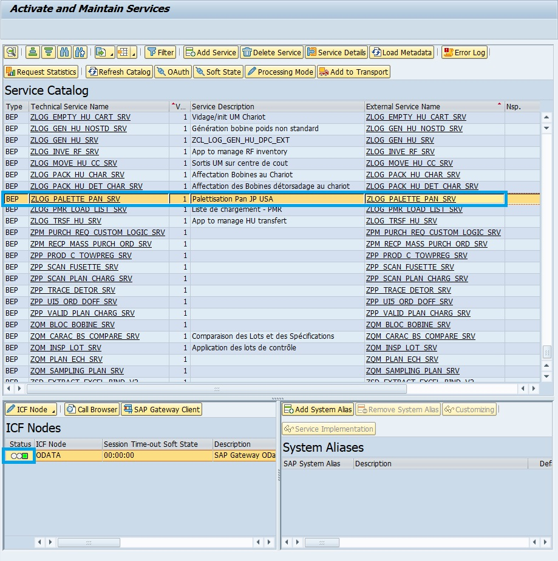
  

## GITLAB

    
CREATION - REPOSITORY

- ``GITLAB`` - Création du repository ``ZLOG_PALETTE_PAN``

    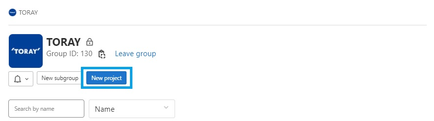

    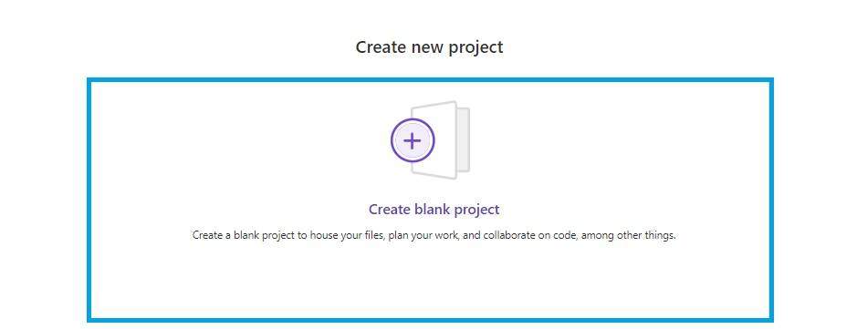

    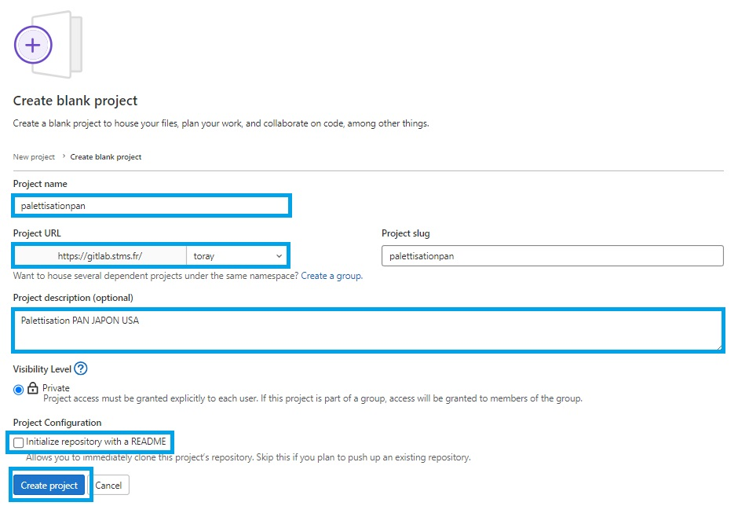

    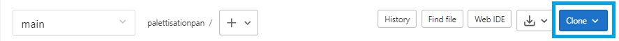
  

## FRONTEND

    
CREATION - DEV SPACE

- ``SAP BUSINESS APPLICATION STUDIO`` - Création du Dev Space ``ZLOG_PALETTE_PAN``

    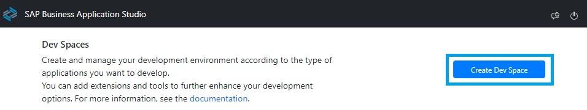

    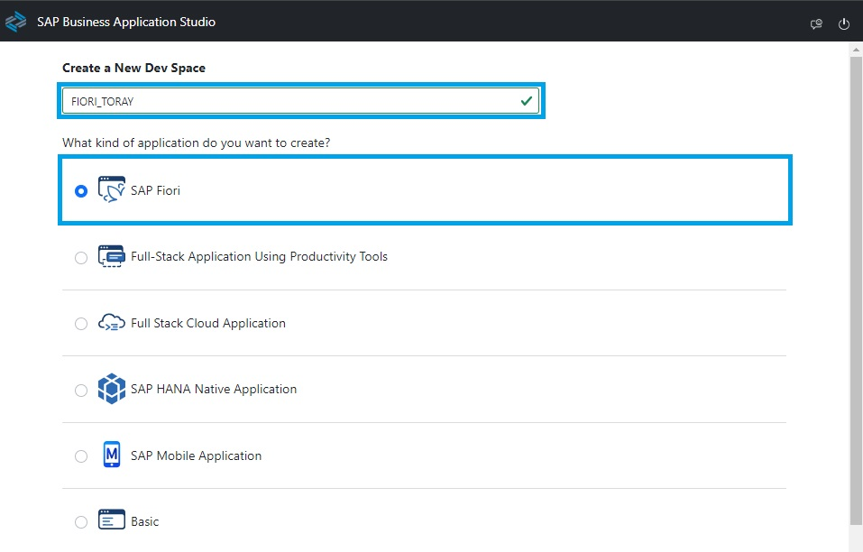

    Additional SAP Extensions:

    - 	HTML5 Application Template
    -   Launchpad Module
    -   Development Tools for SAP Build Work Zone

    
  

    
CREATION - PROJECT

- ``SAP BUSINESS APPLICATION STUDIO`` - Création du projet ``palettisationpan``

    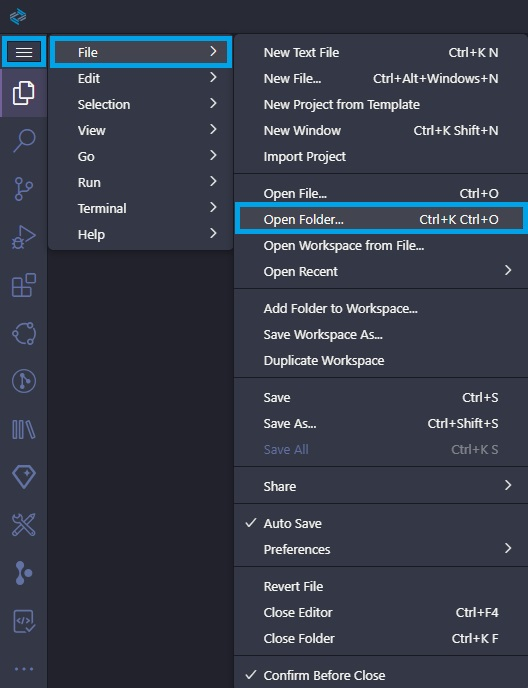

    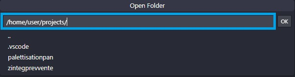

    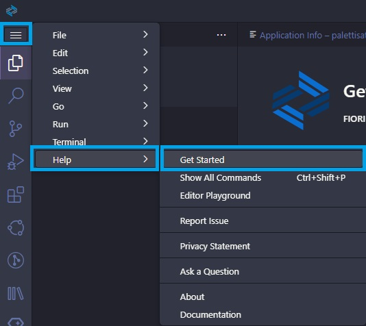

    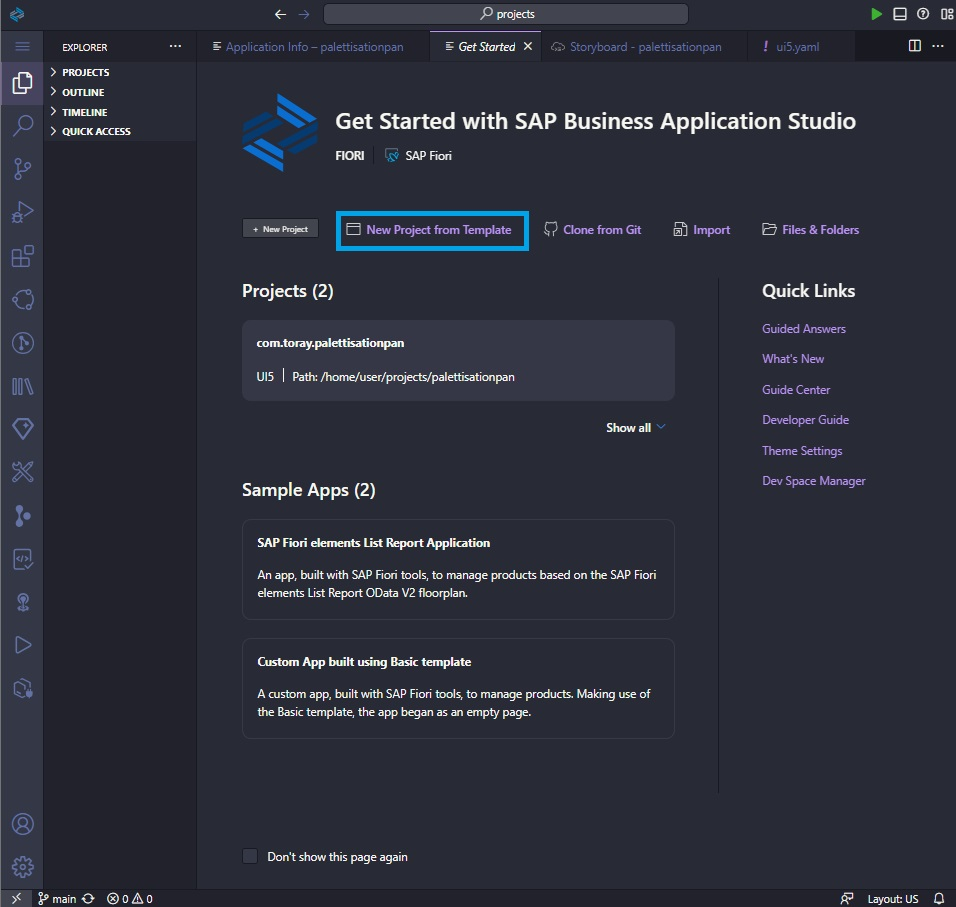

    Select Template and Target Location

    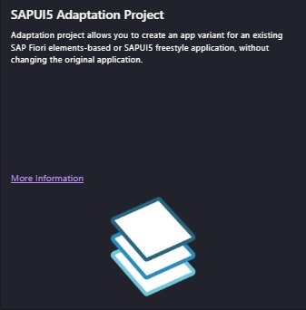

    
CONFIGURATION - MANDANT DEV100/TEST120

- ``SAP BUSINESS APPLICATION STUDIO`` - Création du projet ``palettisationpan``

    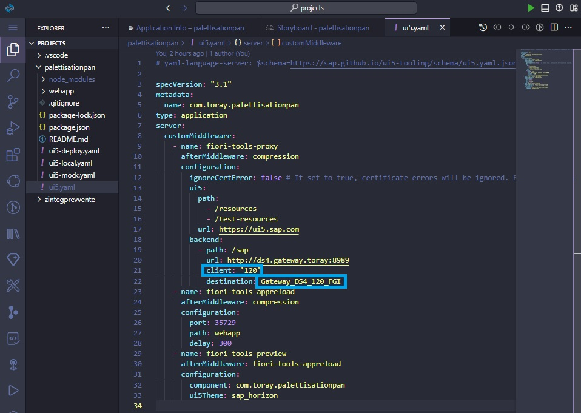

    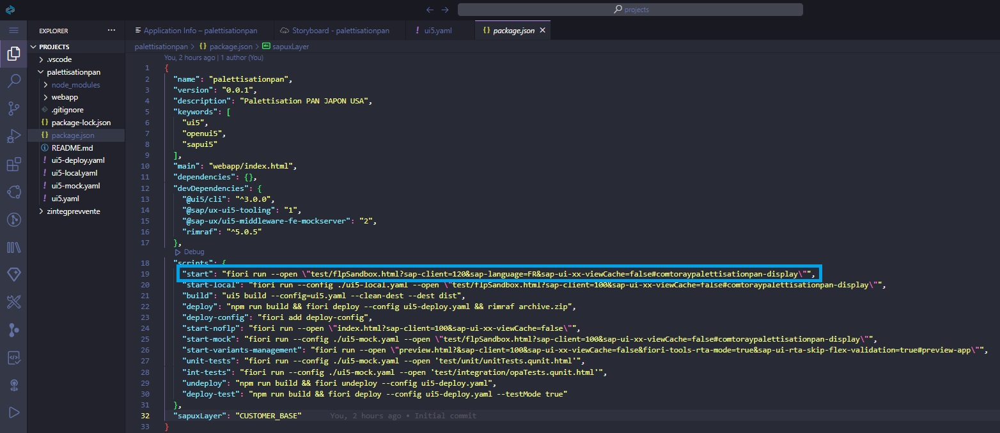

    
BIND - GITLAB

- ``SAP BUSINESS APPLICATION STUDIO`` - Lier le projet au repository ``palettisationpan``

    

    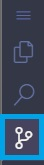

    Stage all & Commit

    Then paste repository url

    Enter username & password

