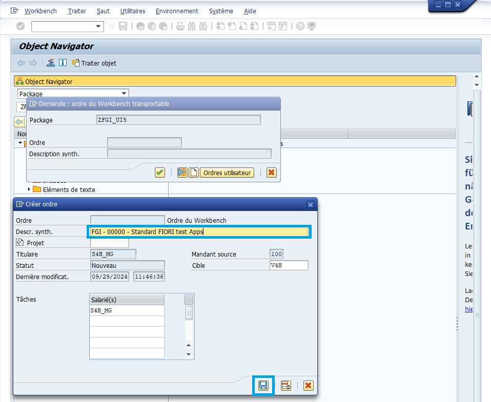
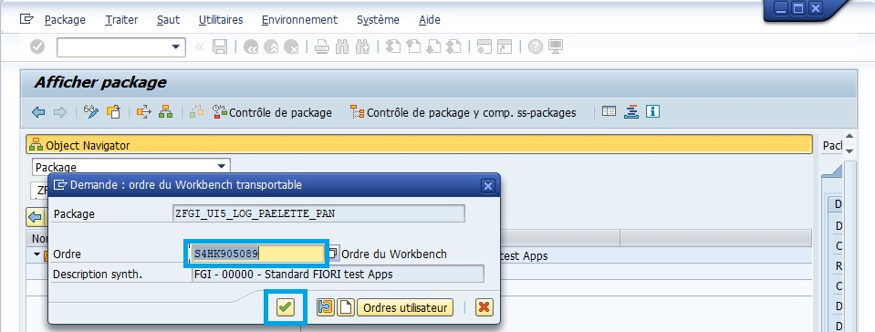
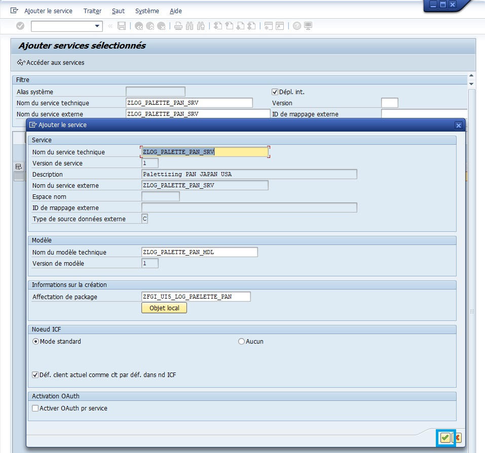
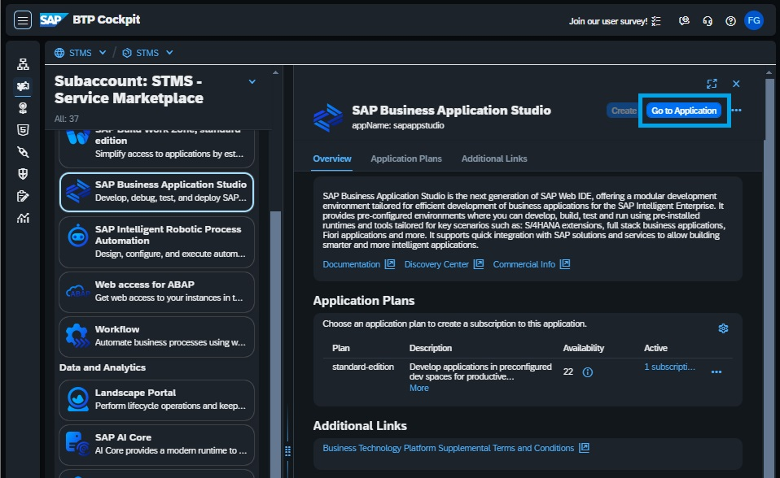

# CREATION APPLICATION UI5

## BACKEND

    
CREATION - UI5 SUPERPACKAGE

- ``SE80`` - Création du package UI5 ``ZFGI_UI5`` en tant que Superpackage.

    Par convention, un ``Superpackage UI5`` est créé par module (i.e ``ZLOG``, ``ZMM``, ``ZFI``, ...). Ce dernier contiendra des packages spécifiques pour chaque ``App``.
    
    Dans l'exemple ci-dessous, le Package ``ZFGI_UI5`` sera le "Super" ``Superpackage`` de l'enemble de nos tests. Il contiendra plusieurs ``Superpackage`` (un pour chaque module) qui contiendront à leur tour un à plusieurs packages pour chaque App concerné par ce module.

    

    

    

    

    
  

    
CREATION - UI5 MODULE PACKAGE

- ``SE80`` - Création du package UI5 ``ZFGI_UI5_LOG`` en tant que package pour le module EWM.

    

    

    
  

    
CREATION - UI5 APP PACKAGE

- ``SE80`` - Création du package UI5 ``ZFGI_UI5_LOG_PALETTE`` en tant que package pour le module EWM.

    

    

    
  

    
CREATION - GATEWAY

- ``SEGW`` - Création de la Gateway ``ZLOG_PALETTE_PAN``

    

    

    

    

    

    
  

    
ACTIVATION - SERVICE

- ``/IWFND/MAINT_SERVICE`` - Activation du Service ``ZLOG_PALETTE_PAN``

    

    

    

    

    

    
  

    
CHECK - SERVICE

- ``SE10`` - Vérification

    
  

## GITLAB

    
CREATION - REPOSITORY

- ``GITLAB`` - Création du repository ``ZLOG_PALETTE_PAN``

    

    

    

    
  

## FRONTEND

    
NAVIGATION - BTP COCKPIT

- ``SAP BUSINESS APPLICATION STUDIO`` - Création Destination & Dev Space ``ZLOG_PALETTE_PAN``

    
  

    
CREATION - DESTINATIONS

- ``SAP BUSINESS TO PARTNER COCKPIT`` - Navigation vers le BAS

    

    
  

    
CREATION - DEV SPACE

- ``SAP BUSINESS TO PARTNER COCKPIT`` - Navigation vers le BAS

    

    

    

    

    Additional SAP Extensions:

    - 	HTML5 Application Template
    -   Launchpad Module
    -   Development Tools for SAP Build Work Zone

    
  

    
CREATION - PROJECT

- ``SAP BUSINESS APPLICATION STUDIO`` - Création du projet ``palettisationpan``

    

    

    

    

    Select Template and Target Location

    

    

    

    
CONFIGURATION - MANDANT DEV100/TEST120

- ``SAP BUSINESS APPLICATION STUDIO`` - Création du projet ``palettisationpan``

    

    

    
BIND - GITLAB

- ``SAP BUSINESS APPLICATION STUDIO`` - Lier le projet au repository ``palettisationpan``

    

    Process:

    - Stage all & Commit
    - Paste repository url
    - Enter username & password

